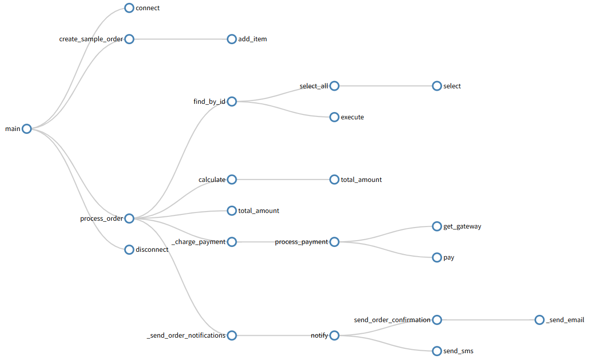

# CodeMap – Python Code Visualizer



Visualize your Python project from multiple aspects:
- **Dependency Graph** – which modules import which
- **Call Tree** – interactive mind‑map of nested function calls
- **Call Graph** – function call chain starting from an entry point
- **Heatmap** – complexity hotspots across your codebase

## Installation

```bash
pip install codemap
```
Or from source:
```bash
git clone https://github.com/kirito-chen/codemap
cd codemap
conda create -n codemap_env python=3.9
conda activate codemap_env
pip install -e .
```

## Usage

### CLI (Command Line)
```bash
# 1. Dependency graph (HTML, interactive)
codemap deps ./test_project --output deps.html

# 2. Interactive call tree (HTML mind‑map, skips built‑ins)
codemap tree ./test_project/main.py --entry start --output call_tree.html

# 3. Call graph (Mermaid format, can be embedded into Markdown)
codemap calls ./test_project/main.py --entry start --format mermaid
# If you only need plain text, you can add -- format json to view JSON format
codemap calls ./test_project/main.py --entry start --format json

# 4. Heatmap (HTML grid)
codemap heatmap ./test_project --metric complexity --output heatmap.html
# or You can also use -- metric lines to count the number of lines of code
codemap heatmap ./test_project --metric lines --output lines_heat.html
```
## Python API
```python
from codemap import build_dependency_graph, build_call_graph, build_heatmap

# Dependency
graph = build_dependency_graph("./test_project")
graph.render("deps.html")

# Call graph
call_data = build_call_graph("./test_project/main.py", "run_server")
print(call_data.to_mermaid())

# Heatmap
heatmap = build_heatmap("./test_project", metric="complexity")
heatmap.save("heatmap.html")
```

## Features
- **Zero configuration** – just point to a directory.

- **Interactive HTML** for dependency graph, heatmap, and call tree.

- **Mermaid output** for call graphs (copy into any Markdown file).

- **Extensible** – easy to add support for other languages via tree-sitter.

## Metrics for Heatmap
- **complexity** – cyclomatic complexity (using radon)

- **lines** – lines of code (excluding blank lines and comments)

- **commits** – not implemented in this version, you can extend

## project structure
- CodeMap/
- ├── setup.py                 # set up script
- ├── README.md                # complete document
- ├── codemap/
- │   ├── __init__.py          # Package entrance, exposing high-level APIs
- │   ├── cli.py               # Command line interface (Click)
- │   ├── deps.py              # Function 1: Dependency Graph
- │   ├── tree.py              # Function 2: Recursive call tree (mind‑map)
- │   ├── calls.py             # Function 3: Function Call Graph
- │   ├── heatmap.py           # Function 4: Code Heat Map
- │   ├── utils.py             # Public tools (traversing files, AST assistance)
- │   └── use_codemap_api.py   # use codemap api test
- └── test_project/            # Simple project
